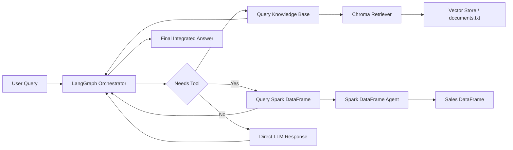

# Spark RAG Agent

A sophisticated AI agent that combines Apache Spark for structured data analytics with Retrieval-Augmented Generation (RAG) for unstructured knowledge querying, orchestrated through LangGraph.

## Features

- **Structured Data Analytics**: Query transactional sales data using Spark DataFrames with natural language
- **Unstructured Knowledge Base**: Retrieve relevant information from corporate policies and documents using vector search
- **Intelligent Orchestration**: LangGraph-based workflow that routes queries to appropriate tools
- **Robust Error Handling**: Comprehensive exception handling for production reliability
- **Modular Architecture**: Clean, maintainable code structure with proper logging

## Architecture

The agent consists of:

1. **Spark DataFrame Agent**: Handles structured queries on sales data (revenue, employees, departments)
2. **Vector Store Retriever**: Searches unstructured corporate documents using embeddings
3. **LangGraph Orchestrator**: Routes user queries to appropriate tools and manages conversation flow
4. **OpenAI GPT-4 Integration**: Powers both the orchestrator and individual agents

## Workflow Diagram



## Prerequisites

- Python 3.13+
- Java 8+ (for Spark)
- OpenAI API key

## Installation

1. Clone the repository:
   ```bash
   git clone <repository-url>
   cd spark-rag-agent
   ```

2. Install dependencies:
   ```bash
   pip install -e .
   ```

3. Set up environment variables:
   ```bash
   export OPENAI_API_KEY="your-openai-api-key-here"
   ```

## Usage

Run the agent:

```bash
python main.py
```

The agent will execute two test queries:
1. Querying unstructured knowledge base for travel expense policies
2. Querying structured sales data for revenue calculations

## Configuration

- **Spark Memory**: Configured with 4GB driver memory (adjustable in `main.py`)
- **Vector Search**: Returns top 1 result per query (configurable)
- **LLM Model**: Uses GPT-4o with temperature 0 for deterministic responses
- **Knowledge Base**: Reads documents from `documents.txt` file. Each document should be separated by blank lines.

## Knowledge Base Setup

Create a `documents.txt` file in the project root with your corporate documents. Format each document on separate lines, separated by blank lines:

```
Document ID 101: Your first document content here.

Document ID 102: Your second document content here.
```

The system will automatically split and embed these documents for retrieval.

## Error Handling

The agent includes comprehensive error handling for:
- Spark session initialization failures
- OpenAI API connection issues
- Vector store operations
- DataFrame query errors
- Graph execution problems

All errors are logged with detailed information for debugging.

## Dependencies

- `pyspark`: Apache Spark for data processing
- `langchain`: Framework for LLM applications
- `langgraph`: Orchestration framework
- `chromadb`: Vector database for document storage
- `openai`: OpenAI API client

## Development

The code is organized into a `SparkRAGAgent` class with the following key methods:
- `_setup_environment()`: Environment configuration
- `_initialize_spark()`: Spark session setup
- `_initialize_llms()`: LLM initialization
- `_setup_knowledge_base()`: Vector store creation
- `_setup_spark_tools()`: DataFrame agent setup
- `_build_graph()`: LangGraph workflow construction
- `run_query()`: Execute queries
- `stream_query()`: Debug streaming execution

## License

[Add your license here]